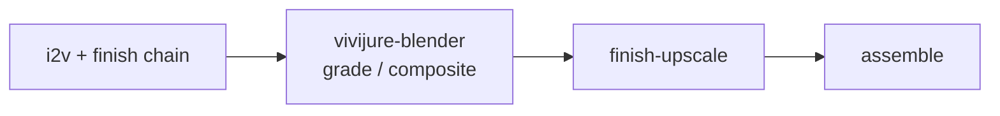

# vivijure-blender

[](LICENSE)

**Headless Blender compositor for [Vivijure](https://github.com/skyphusion-labs/vivijure).**  
A finish-chain satellite: grade gen clips with fixed color presets (and optional plate underlay). Runs on RunPod Serverless. Powers the studio **`finish-blender`** module.

## Where this fits



- **Does:** templated compositor grades (`neutral`, `filmic_warm`, `high_contrast`, `cool`, `soft`); optional plate alpha-over (`job_type=composite`).
- **Does not (v1):** free-form `.blend` upload, user Python/`bpy`, EEVEE real-time, full 3D Cycles shots (later `film.finish` / motion templates).
- **Does not replace:** ffmpeg assemble (`video-finish`), MuseTalk, Real-ESRGAN, or i2v backends.

Same constellation map as other finish engines: see [docs/constellation.md](docs/constellation.md).

## Deploy

```bash
cp deploy.env.example deploy.env   # fill RUNPOD_API_KEY, IMAGE, R2_*, ...
./deploy.sh                        # build, push, create/update endpoint
```

Full walk-through: [docs/deploy.md](docs/deploy.md).

Wire into the studio:

1. Put the printed endpoint id in `BLENDER_RUNPOD_ENDPOINT_ID` (vivijure-cf `deploy.env` / Secrets Store).
2. Deploy `modules/finish-blender` (`MODULE_FINISH_BLENDER`).
3. See studio [opt-in-tiers](https://github.com/skyphusion-labs/vivijure-cf/blob/main/docs/opt-in-tiers.md) (`finish-blender`).

## Job contract (R2 mode)

```json
{
  "project": "my-film",
  "clip_key": "renders/my-film/clips/shot_01.mp4",
  "output_key": "renders/my-film/clips/shot_01_bl.mp4",
  "job_type": "grade",
  "preset": "filmic_warm",
  "strength": 1.0
}
```

Self-test (no R2): `{"selftest": true}`.

## Dev (CPU)

```bash
python3 -m venv .venv && . .venv/bin/activate
pip install -r requirements.txt pytest
pytest -q
```

Full Blender smoke needs the Docker image or a local `BLENDER_BIN`.

## License

**AGPL-3.0-only** for this repo. The Docker image ships **Blender** (GPL) and **ffmpeg** as separate binaries; see [NOTICE](NOTICE).
