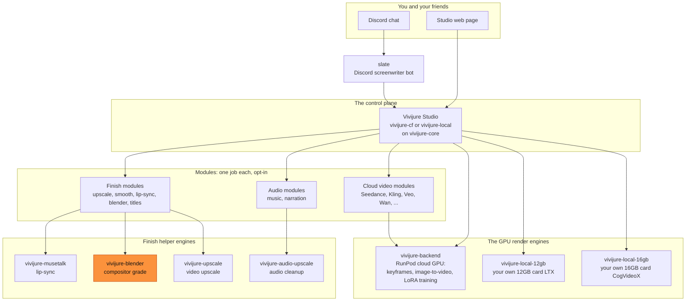
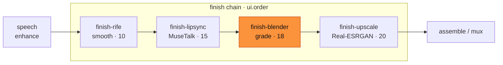
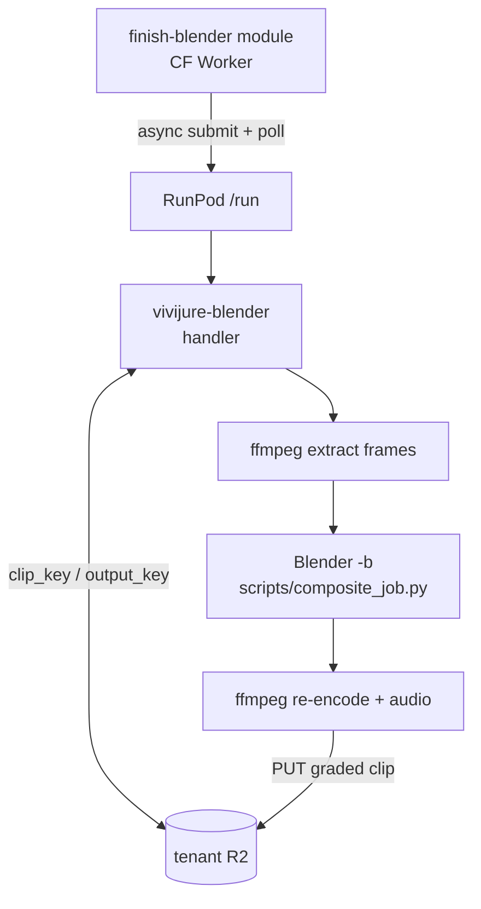

# vivijure-blender

[](LICENSE)
[](https://console.runpod.io/hub/skyphusion-labs/vivijure-blender)

**Grades your finished clips with a headless Blender compositor.** This is the color-grade finish
engine for [Vivijure](https://github.com/skyphusion-labs/vivijure), the AI film studio. It runs on
RunPod Serverless, takes a shot clip, and hands back a graded version using fixed look presets.
Under the hood it is **Blender LTS** (GPL) driven by a baked bpy graph -- no free-form scripts.

## Where this fits

Vivijure is not one program. It is a small group of programs that work together, called the
**constellation**. The **Studio** is the center; it tells engines like this one what to do. This map
is the same in every repo, so you always know where you are.



You are here: **`vivijure-blender`** is the orange finish helper. The studio module that talks to it
is **`finish-blender`** (`MODULE_FINISH_BLENDER`). The full map is in
[docs/constellation.md](docs/constellation.md).

### Finish-chain order

This engine runs **after** lip-sync and **before** upscale, so grades apply at native resolution
and the upscaler enlarges the already-looked clip.



### Job path (this repo)



- **Does:** templated compositor grades (`neutral`, `filmic_warm`, `high_contrast`, `cool`, `soft`);
  optional plate alpha-over (`job_type=composite`).
- **Does not (v1):** free-form `.blend` upload, user Python/`bpy`, EEVEE real-time, full 3D Cycles
  shots (later `film.finish` / motion templates).
- **Does not replace:** ffmpeg assemble (`video-finish`), MuseTalk, Real-ESRGAN, or i2v backends.

## Deploy this finish engine

You need a **RunPod** account and a **registry** for the image (GHCR). Then:

```bash
cp deploy.env.example deploy.env   # fill RUNPOD_API_KEY, IMAGE, R2_*, ...
./deploy.sh                        # build, push, create/update endpoint
```

Idempotent and fail-closed. Full walk-through: [docs/deploy.md](docs/deploy.md).

Published image (tag-gated CI): `ghcr.io/skyphusion-labs/vivijure-blender:<version>`
(e.g. `0.1.0`). Pin the endpoint template to an explicit version; there is no `:latest`.

## Turn it on in the studio

This engine powers the studio's **finish-blender** module (opt-in; not required for the
`satellites` profile triad).

1. Copy the endpoint id `./deploy.sh` printed.
2. Set **`BLENDER_RUNPOD_ENDPOINT_ID`** in the studio Secrets Store / `deploy.env`.
3. Enable the `MODULE_FINISH_BLENDER` service binding (see vivijure-cf `wrangler.toml.example`).
4. Deploy `vivijure-module-finish-blender`.

See studio [docs/opt-in-tiers.md](https://github.com/skyphusion-labs/vivijure-cf/blob/main/docs/opt-in-tiers.md)
(`finish-blender`).

## Job contract (R2 mode)

```json
{
  "project": "my-film",
  "clip_key": "renders/my-film/clips/shot_01.mp4",
  "output_key": "renders/my-film/clips/shot_01_bl.mp4",
  "job_type": "grade",
  "preset": "filmic_warm",
  "strength": 1.0
}
```

Presigned mode: `video_url` + `output_url` + `output_key` (the written key
returned as `clip_key`; the mode name is never substituted). Optional
`plate_url` for composite. Caller URLs are https-only and DNS-pinned.

Self-test (no R2): `{"selftest": true}`.

## Dev (CPU)

```bash
python3 -m venv .venv && . .venv/bin/activate
pip install -r requirements.txt pytest
pytest -q
```

Full Blender smoke needs the Docker image or a local `BLENDER_BIN`.

## License

**AGPL-3.0-only** for this repo. The Docker image ships **Blender** (GPL) and **ffmpeg** as separate
binaries; see [NOTICE](NOTICE).
