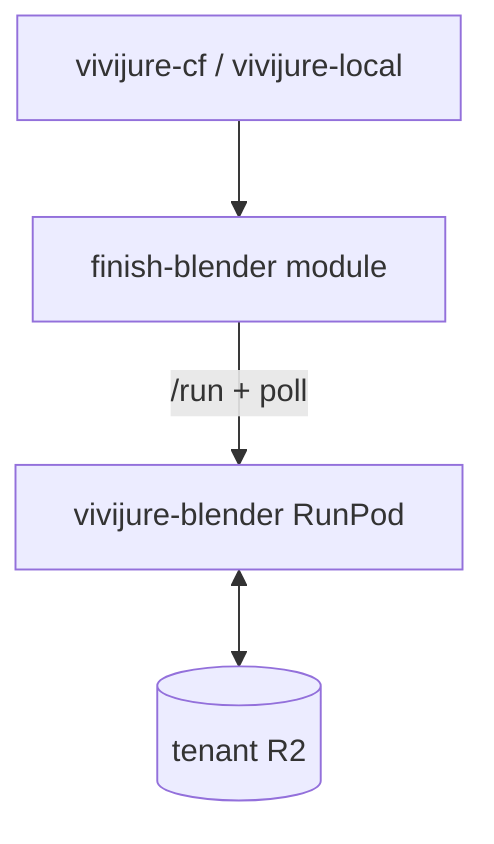

# Constellation: vivijure-blender

You are in a **finish helper engine**. The studio invokes the CF module `finish-blender`
(`MODULE_FINISH_BLENDER`); that module submits async jobs to this RunPod endpoint.

Sibling finish engines: `vivijure-musetalk`, `vivijure-upscale`, `vivijure-audio-upscale`.  
GPU render spine: `vivijure-backend`. CPU assemble: `video-finish` container (not this repo).
